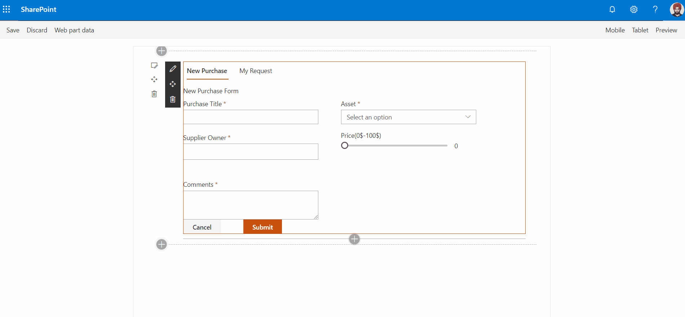

# React sample webpart 

## Summary

This web part demonstrate a sample functioning of a SharePoint form. It uses pnpjs to perform crude operation on a SharePoint list. Moreover, it uses Microsoft Open UI fabric controls to render content on webpart.

## Used SharePoint Framework Version

## Minimal Path to Awesome

- git clone the repo
- npm i
- gulp bundle --ship
- gulp package-solution --ship
- Add to App Catalog and Install the App
- Add the web part to a page

## Solution

Solution|Author(s)
--------|---------
react sample webpart|Navjot Singh

